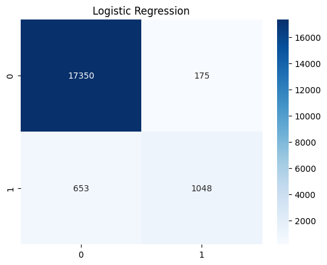

# Laporan Proyek Machine Learning - Eko Rahmat Darmawan

Nama : Eko Rahmat Darmawan
Email : Erdarmawan7@gmail.com
ID Dicoding : echo_ramled

## Domain Proyek

#### Latar Belakang Masalah

Diabetes adalah salah satu penyakit yang paling serius dan terus meningkat secara global. Penyakit ini sering menyebabkan komplikasi serius seperti penyakit jantung, stroke, dan gagal ginjal. Salah satu tantangan utama adalah prediksi dini risiko diabetes untuk mengurangi dampak komplikasi dan meningkatkan efektivitas program pencegahan. Model prediksi berbasis pembelajaran mesin (machine learning) menawarkan solusi yang efisien dengan akurasi tinggi untuk mendeteksi individu berisiko tinggi dan mengurangi ketergantungan pada keputusan manusia, yang sering kali rentan terhadap kesalahan.

#### Jelaskan mengapa dan bagaimana masalah tersebut harus diselesaikan?

Masalah ini harus diselesaikan untuk mengurangi beban kesehatan masyarakat akibat komplikasi diabetes yang tidak terdiagnosis secara dini. Pendekatan berbasis pembelajaran mesin seperti RandomForest (RF) dan Logistic Regression (LR) dapat digunakan untuk mengidentifikasi individu yang berisiko tinggi. Dengan model ini, langkah-langkah pencegahan seperti perubahan gaya hidup atau intervensi medis dapat diterapkan lebih awal.

Evaluasi model menggunakan metrik seperti precision, recall, dan accuracy menunjukkan bahwa algoritme RF memiliki performa prediksi yang lebih unggul dibandingkan LR, sehingga memberikan solusi yang lebih efektif.

Referensi : [Comparison of Statistical Logistic Regression and RandomForest Machine Learning Techniques in Predicting Diabetes](https://www.jait.us/uploadfile/2020/0417/20200417070739281.pdf)

## Business Understanding

### Problem Statements

Menjelaskan pernyataan masalah latar belakang:

- Pernyataan Masalah 1

Bagaimana performa model RandomForest dibandingkan dengan Logistic Regression dalam memprediksi risiko diabetes pada data?

- Pernyataan Masalah 2

Faktor-faktor apa saja yang paling berkontribusi dalam meningkatkan akurasi model prediksi diabetes menggunakan pembelajaran mesin?

### Goals

Menjelaskan tujuan dari pernyataan masalah:

- Jawaban pernyataan masalah 1

Berdasarkan hasil penelitian, model RandomForest memiliki performa yang lebih baik dibandingkan Logistic Regression dalam memprediksi diabetes. RF menunjukkan precision sebesar 88,3% dan AUC sebesar 0,944, sedangkan LR hanya mencapai precision sebesar 69,2% dan AUC sebesar 0,708. Hal ini menunjukkan bahwa RF lebih andal dalam mengidentifikasi individu berisiko tinggi dengan kesalahan klasifikasi yang lebih rendah.

- Jawaban pernyataan masalah 2

Faktor-faktor risiko utama yang digunakan dalam model prediksi meliputi atribut demografis (usia, jenis kelamin), atribut kesehatan (indeks massa tubuh, tekanan darah), dan hasil uji laboratorium seperti kadar hemoglobin, jumlah sel darah putih, dan hematokrit. Atribut-atribut ini berkontribusi signifikan dalam meningkatkan akurasi model karena menyediakan data yang relevan untuk analisis. 

### Solution statements
Solusi untuk mengoptimalkan prediksi diabetes adalah dengan mengimplementasikan algoritma RandomForest sebagai alat prediksi utama dalam sistem kesehatan berbasis data elektronik (EHR). Evaluasi model dapat dilakukan menggunakan metrik berikut:

Akurasi Model: Tingkat keberhasilan model dalam klasifikasi benar (diukur menggunakan AUC > 0,9).
Recall: Kemampuan model mendeteksi individu yang benar-benar berisiko tinggi (target recall > 80%).

Dengan metrik ini, keberhasilan solusi dapat diukur dan disesuaikan untuk memastikan manfaat yang optimal dalam deteksi dini diabetes.

## Data Understanding

Prediksi diabetes merupakan proyek untuk memprediksi data medis seseorang terindikasi terkena diabetes atau tidak. Dataset yang digunakan menggunakan data public dari situs kaggle yang bisa diunduh <a href='https://www.kaggle.com/datasets/iammustafatz/diabetes-prediction-dataset'>disini</a>.

Dataset berupa data medis tabular pasien dengan status diabetes (positif dan negatif). Data berformat CSV dengan 9 fitur atau kolom atau variabel dengan 1000 baris record data.

### Variabel-variabel pada diabetes prediction dataset adalah sebagai berikut:
- Usia (age) : 
  Berisi data usia pasien, bertipe data integer atau numerik. Eksplorasi fitur dapat dilakukan seperti mendapatkan rata-rata usia pada dataset, rata-rata usia yang mengidap diabetes, serta memvisualisasikan distribusi diabetes berdasarkan usia menggunakan diagram boxplot.

  

- Jenis kelamin (gender) : 
  Berisi data jenis kelamin pasien dengan kategori male (male) dan female (perempuan), bertipe data string atau object dalam dataframe. Eksplorasi fitur yang dilakukan berupa menghitung jumlah setiap kategori menggunakan fungsi value_count() serta memvisualisasikan distribusi jenis kelamin menggunakan diagram batang dan diagram  lingkaran atau pie untuk mengetahui persentase banyaknya kategori.

  

- Riwayat hipertensi (hypertension) : 
  Berisi data riwayat hipertensi pada pasien dengan nilai 0 atau 1. Nilai 0 melambangkan tidak ada riwayat hipertensi sedangkan nilai 1 melambangkan pasien memiliki riwayat hipertensi. Bertipe data integer atau numerik. Eksplorasi fitur yang dilakukan berupa menghitung jumlah setiap kategori menggunakan fungsi value_count() serta memvisualisasikan distribusi jenis kelamin menggunakan diagram batang dan diagram  lingkaran atau pie untuk mengetahui persentase banyaknya kategori.

  

- Riwayat penyakit jantung (heart_disease) : 
  Berisi data riwayat penyakit jantung pada pasien dengan nilai 0 atau 1. Nilai 0 melambangkan tidak ada riwayat jantung sedangkan nilai 1 melambangkan pasien memiliki riwayat sakit jantung. Bertipe data integer atau numerik. Eksplorasi fitur yang dilakukan berupa menghitung jumlah setiap kategori menggunakan fungsi value_count() serta memvisualisasikan distribusi jenis kelamin menggunakan diagram batang dan diagram  lingkaran atau pie untuk mengetahui persentase banyaknya kategori.

  

- Riwayat Merokok (smoking_history) : 
  Berisi data riwayat merokok pada pasien dengan 6 kategori yaitu never (tidak pernah), no info (tidak ada informasi), current (aktif sekarang), former (mantan perokok), ever (pernah), not current (tidak aktif). Bertipe data string atau objek dalam dataframe.  Eksplorasi fitur yang dilakukan berupa menghitung jumlah setiap kategori menggunakan fungsi value_count() serta memvisualisasikan distribusi jenis kelamin menggunakan diagram batang dan diagram  lingkaran atau pie untuk mengetahui persentase banyaknya kategori.

  

- Indeks Berat Badan / Body Mass Index (BMI) : 
  Berisi data indeks berat badan pasien untuk indentifikasi pengaruh berat badan obesitas terhadap diabetes. Bertipe data float. Ekslorasi data yang dilakukan menampilkan rata-rata berat badan yang mengidap diabetes serta memvisualisasikan distribusi berat badan menggunakan distplot dan distribusi diabetes berdasarkan berat badan menggunakan diagram boxplot.

  

- HbA1c Level : Berisi data tingkat HbA1c atau intensitas gula pada sel darah
- Level Gula Darah (blood_glucose_level) : Berisi data tingkat gula dalam darah
- Diabetes : Berisi data diabetes dengan nilai 0 atau 1 untuk melambangkan tidak diabetes atau diabetes

## Data Preparation
Data Prepration yang dilakukan mulai dari data cleaning kemudian dilanjut dengan data preprocessing. Data cleaning bertujuan untuk membersihkan data sebelum digunakan untuk proses training model machine learning. Sedangkan data preprocessing bertujuan untuk menyamakan atau standarisasi nilai variabel dari data untuk proses training model machine learning.

### Data Cleaning
Data cleaning berguna untuk membersihkan data dari data kosong, data duplikat, dan lain-lain yang dapat mempengaruhi kualitas dan performa model machine learning yang dikembangkan. Teknik data cleaning yang umum dilakukan untuk mengatasi permasalahan data seperti data missing value dan data duplikat

- Missing Values: 
Pada dataset yang digunakan tidak terdapat baris atau data yang memiliki null value atau missing value, sehingga tidak diperlukannya proses untuk mengatasi missing value

- Data duplikat: 
Terdapat sekitar 3854 data duplikat. Data duplikat mempengaruhi ketidakberagamannya data untuk dipelajari model machine learning yang dapat mengakibatkan hasil training kurang baik. Cara mengatasi data duplikat pada proyek ini dengan menghapus data duplikat menggunakan fungsi pandas drop_duplicated().

### Data Preprocessing
Setelah data bersih dari proses data cleaning, proses yang dilakukan selanjutnya ialah data preprocessing. Pada proyek ini teknik preprocessing yang dilakukan seperti data transform atau encoding dan data split.

- Encoding:
Proses untuk mengubah data kategorikal menjadi numerik. Pada proyek ini variabel yang di encoding ialah jenis kelamin atau gender dan riwayat merokok atau smoking history. Variabel gender di transform dari nilai kategori male atau female ke nilai numerik 0 atau 1. Sedangkan variabel smoking_history dari 6 kategori seperti never, no info, current, former, ever, not current menjadi nilai numerik 0 sampai 5.

- Data Splitting:
Proses untuk membagi data menjadi 2 bagian yaitu data training dan data testing. Data training digunakan untuk melatih algoritma model machine learning untuk mengenali variabel-variabel dalam data. Sedangkan data testing digunakan untuk proses evaluasi hasil training model. Pada proyek ini, sebelum proses data splitting, data dibagi menjadi fitur dan label. Fitur dilambangkan dengan variabel X yang berisi variabel-variabel yang berhubungan atau berpengaruh dalam menentukan data pasien terkena diabetes atau tidak. Fitur x berisi vaiabel atau kolom mulai dari gender, age, hypertension, heart disease, smoking history, bmi, HbA1c level, dan blood glucose level. Sedangkan label diwakili dengan variabel Y yang berisi variabel atau kolom diabetes yeng bernilai 0 atau 1 yang melambangkan tidak diabetes atau diabetes. Setelah dipisah fitur dan label, baru proses data spliiting dilakukan. Data splitting menggunakan fungsi train_test_split() dari library sklearn, data dibagi kedalam variabel x_train, y_train, x_test, dan y_test dengan persentase 80% data training dan 20% data testing.

## Modeling
Model machine learning pada proyek ini menggunakan algoritma Logistic Regression dan Random Forest Classifier. Kedua algoritma ini memiliki karakteristik yang berbeda.

1. Logistic Regression

Logistic Regression adalah metode statistik yang digunakan untuk memodelkan probabilitas hasil biner (misalnya, "diabetes" atau "tidak diabetes"). Model ini bekerja dengan menghitung fungsi logit, yaitu logaritma peluang (odds) dari variabel target terhadap kombinasi linear dari variabel input. Logistic Regression sering digunakan untuk masalah klasifikasi sederhana karena menghasilkan probabilitas yang dapat diinterpretasikan dengan baik. Namun, model ini hanya efektif untuk hubungan linear antara variabel dan memerlukan preprocessing seperti normalisasi data dan transformasi variabel kategorikal menjadi numerik.

Cara Kerja:
Logistic Regression memanfaatkan sigmoid function untuk membatasi output probabilitas antara 0 dan 1. Probabilitas yang dihasilkan digunakan untuk menentukan klasifikasi berdasarkan ambang batas tertentu.

Adapun kelebihan dan kekurangan Logistic Regression sebagai berikut.
  
  - Kelebihan :
    - Algoritma yang lebih sederhana dan mudah di intepretasikan.
    - Komputasi yang efisien dan cepat untuk menangani dataset kecil
    - Model probabilistik
    - Fleksibilitas pada variabel yang digunakan baik kategorikal maupun numerik
  
  - Kekurangan:
    - Performa yang rendah pada hubungan variabel non linear
    - Rentan terhadap multikolinearitas
    - Sensitif pada data outlier
    - Keterbatasa akurasi untuk dataset yang besar dan variabel yang sangat banyak

2. Random Forest Classifier

RandomForest adalah algoritma pembelajaran mesin berbasis ensemble yang menggabungkan banyak decision tree untuk membuat prediksi. Algoritma ini bekerja dengan membuat beberapa pohon keputusan independen (dengan subset data dan fitur yang berbeda) dan menggabungkan hasilnya melalui pemungutan suara (voting) untuk klasifikasi atau rata-rata untuk regresi. Metode ini sangat fleksibel dan efektif dalam menangani data dengan jumlah atribut besar dan hubungan nonlinear.

Cara Kerja:
RandomForest menggunakan proses yang disebut bootstrap aggregating (bagging), di mana setiap pohon dilatih pada subset data yang diambil secara acak dengan pengembalian (random sampling). Setiap pohon memilih fitur secara acak pada setiap pembagian node, sehingga menciptakan variasi antar pohon dan meningkatkan akurasi keseluruhan.

Adapun kelebihan dan kekurangan algoritma Random Forest Classification sebagai berikut:

  - Kelebihan:
    - Akurasi tinggi dan mampu menangkap hubungan non linear dengan akurat
    - Ketahanan terhadap overfitting
    - Kemampuan menangani dataset yang besar
    - Kemampuan evaluasi fitur yang penting dalam prediksi
    - Robust terhadap outlier
  - Kekurangan:
    - Kompleksitas komputasi yang memerlukan waktu dan resources yang lebih besar
    - Kurang transparansi dan sulit di intepretasikan
    - Overfitting pada dataset yang kecil
    - Parameter tuning yang diperlukan

## Evaluation
Metrik evaluasi yang digunakan untuk mengevaluasi performa model yang di training pada proyek ini antara lain precision, recall, f1-score, akurasi, serta tampilan confusion matrix.

- Precision :
Persentase prediksi positif yang benar-benar positif. Berfungsi untuk mengukur keakuratan prediksi positif. Nilai tinggi berarti prediksi positif model lebih dapat dipercaya.

- Recall :
Persentase kasus positif yang salah diklasifikasikan sebagai negatif. Bertujuan menunjukkan proporsi kesalahan deteksi terhadap kasus positif. Nilai rendah menunjukkan model mampu meminimalkan kesalahan dalam mendeteksi kasus positif.

- F1-Score :
Harmonic mean dari Precision dan Recall, digunakan untuk menyeimbangkan keduanya. Cocok digunakan saat ada ketidakseimbangan antara kelas positif dan negatif. Memberikan gambaran performa keseluruhan dalam mendeteksi dan memprediksi kasus positif.

- Akurasi : Mengukur persentase prediksi yang benar secara keseluruhan.

- Confusion Matrix :

Confusion matrix adalah tabel yang digunakan untuk mengevaluasi performa model klasifikasi dengan menunjukkan jumlah prediksi yang benar dan salah berdasarkan kelas aktual dan kelas prediksi. Matriks ini memberikan pandangan menyeluruh tentang bagaimana model bekerja pada setiap kelas, sehingga memudahkan analisis kesalahan.

Berikut tampilan confusion matrix model Logistic Regression dan Random Forest Classifier. Untuk Lebih lengkapnya dapat dilihat pada file ipynb.

**---Ini adalah bagian akhir laporan---**
